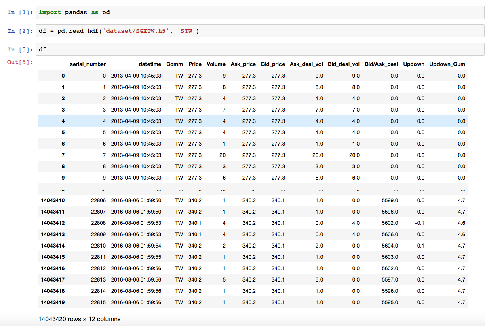
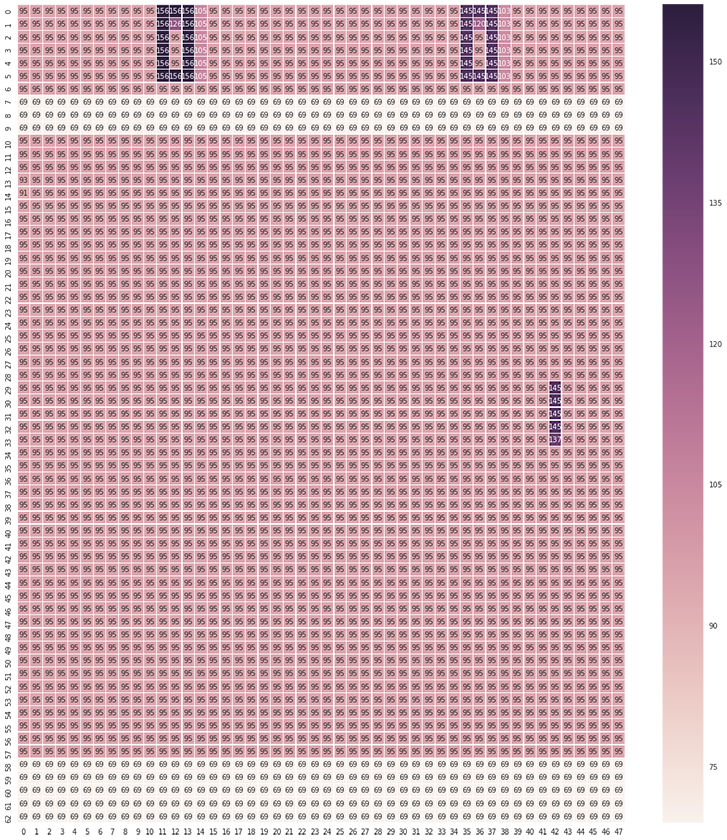
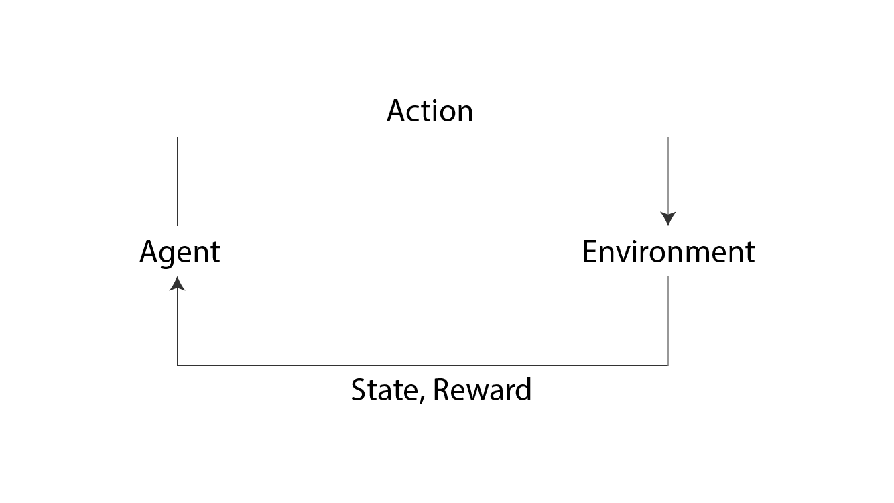
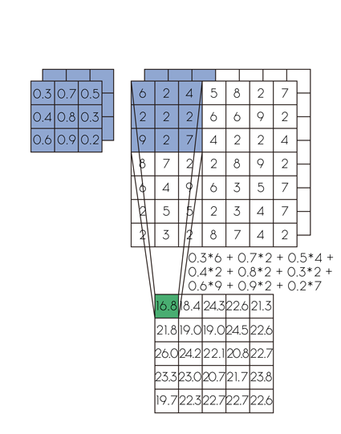
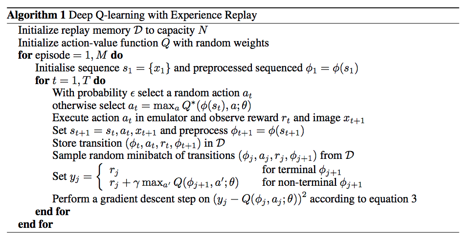
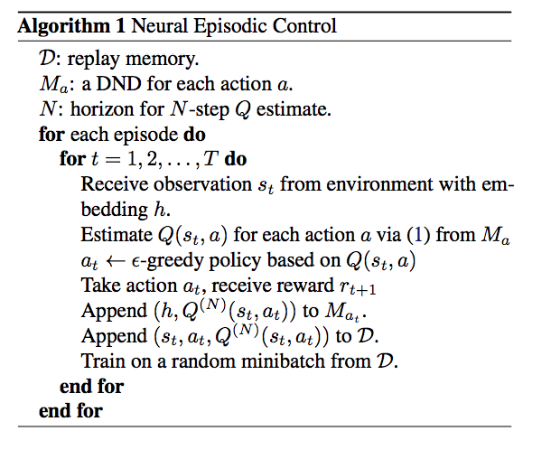

# QuickStart

## Prepare data for training environment

- tick level data



- ### the require columns of env 
  - ### strike price (the price deal in each tick)</br>
    use for calculate the reward and render but will not directly use in model as input, because the input may need the preprocessing. This can show human readable result like transaction, ploting and so on.
  - ### serial number of each date</br> 
    currently v0 and v1 training env use each day as new game for training like the deepmind play the game, it will randomly choice one day to trade using serial number equal to zero to separate that.
  - ### at least one feature data</br>
    the feature data will be the state to return, it can simple like price, volumn, etc.

## Introduce the training environment operation

### first, see the example
#### openai gym usage
``` python
import gym

ENV_ID = 'Pong-v0'
env = gym.make(ENV_ID)

state = env.reset()
```
pong state grayscale       |  plot the value
:-------------------------:|:-------------------------:
| 

``` python 
action_up = 1
action_down = 2
action_stay = 0
while not done:
    action_up_down_or_stay = random.choice([action_up, action_down, action_stay])
    state, reward, done, info = env.step(action_up_or_down)
```


#### trading gym usage
unlike openai gym only choice env_id, with lot of other parameter can control the env with custom data. explain each parameter it on below.

``` python
import pandas as pd
import trading_env

df = pd.read_hdf('dataset/SGXTW.h5', 'STW')

env = trading_env.make(env_id='training_v1', obs_data_len=256, step_len=128,
                       df=df, fee=0.1, max_position=5, deal_col_name='Price',
                       return_transaction=True,
                       feature_names=['Price', 'Volume', 
                                      'Ask_price','Bid_price', 
                                      'Ask_deal_vol','Bid_deal_vol',
                                      'Bid/Ask_deal', 'Updown'])

state = env.reset()
```

- env_id: use `trading_env.available_envs()` to see current implement env
- obs_data_len: see above image, data windows length of the return state
- step_len: when call step function in env will roll the windows keep the obs_data_len but slide step_len
- df: as above prepare data part, just input the whole data and check the requirement
- fee: the cost of each transaction.
- max_position: the max market position for your trading share.
- deal_col_name: as above prepare data part, the strike price columns name
- feature_names: the feature want to use in dataframe of each columns name
- return_transaction: whether to stack the transaction array into state
    - market_position
    - market_position_variation
    - entry_or_cover
    - holding_price
    - holding_price_mean
    - fluctuant_reward
    - make_real
    - make_real_return

#### then same as openai gym env_agent_loop
``` python
buy = 1
sell = 2
stay = 0
while not done:
    action_buy_sell_or_stay = random.choice([buy, sell, stay])
    state, reward, done, info = env.step(action_buy_sell_or_stay)
```

## How to make the RL agent and train it
[dqn to play pong](https://github.com/Yvictor/deep-rl/blob/master/dqn_with_log_summary_nn_saver.ipynb)
- Can just use the above example to create the dqn agent to train but need to modify the convolutional neural network architecture</br>


- above is normal conv layer,the left small cube is kernel and it's kernel size is (3, 3), and the stride is 1, origin input is (7, 7), so the output of the layer is (5,5), see more about [conv net cs231n](http://cs231n.github.io/convolutional-networks/)
- in the my env, if you want to use conv layer, the kernel size can be (1, x) or (feature_number, x) but second kernel size need to change next conv layer kernel size to (1, x)
- if the feature not normalize it should add another layer to normalize each feature
- another part is preprocessing
- training process is like my example 
- [Deep Q learning](https://storage.googleapis.com/deepmind-media/dqn/DQNNaturePaper.pdf) </br>
pseudocode in dqn paper

- [Policy gradient](http://karpathy.github.io/2016/05/31/rl/)
- [One-Setp Q leaning, N-Step Q learing](https://arxiv.org/pdf/1602.01783.pdf)
- [Actor-Critic, A3C](https://arxiv.org/pdf/1602.01783v2.pdf)
- [Neural Episodic Control](https://arxiv.org/pdf/1703.01988.pdf)</br>
nec pseudocode (very similar to dqn but agent learns significantly faster)
 

### [My deep reinforcement learning slides in chinese](https://yvictor.github.io/slides/DQN.slides.html?transition=convex#/)